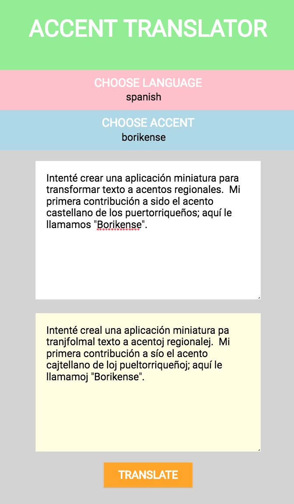

# borikense
Easily expandable webapp for translating text to regional accents.

# Live Website
https://jaimefps.github.io/borikense/

The 2026 app lives in [`/2026`](2026/) and deploys automatically on push to master.
The original 2018 app remains in the repo root.

# To run on your computer
The 2026 app: `cd 2026 && npm i && npm run dev`

The 2018 original: `npm i && npm start`

# TODO
0. Create documentation for contributting. 
1. Create accent exeption logic.
2. Use Jest for testing React components.
